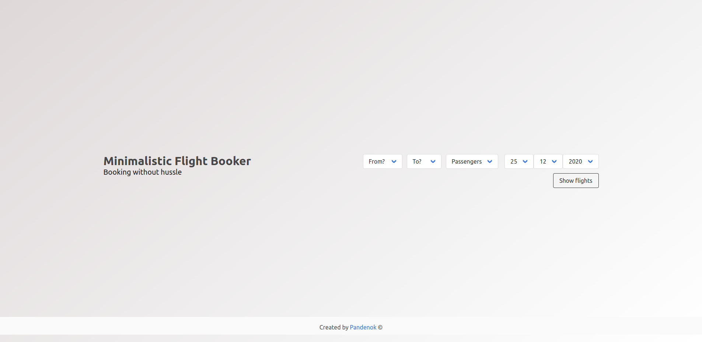
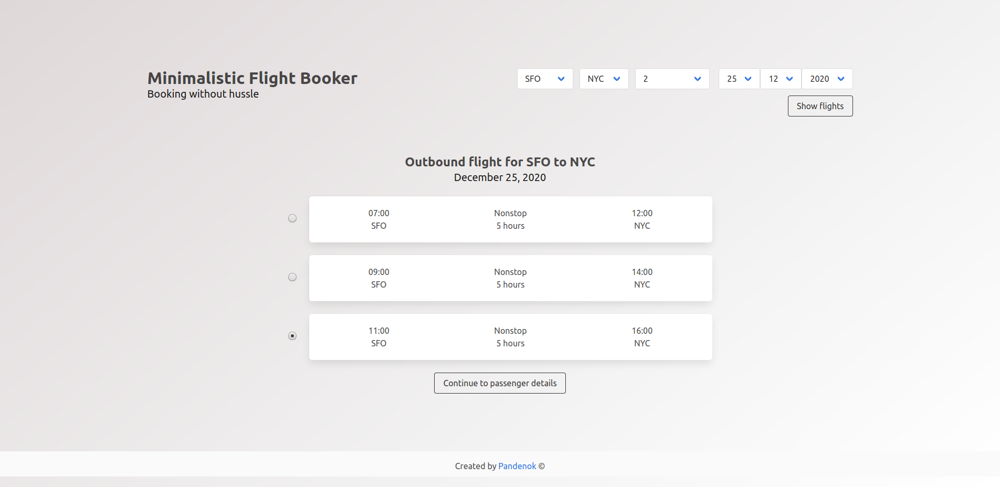
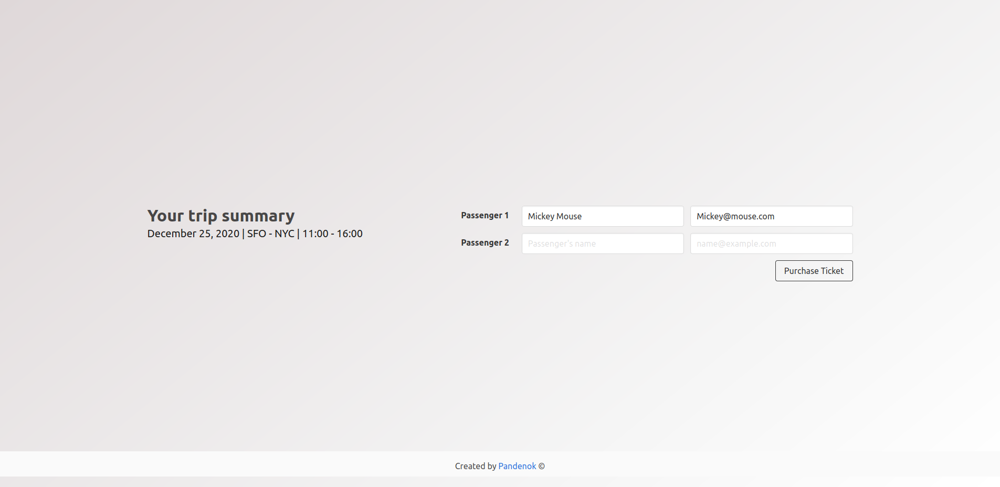
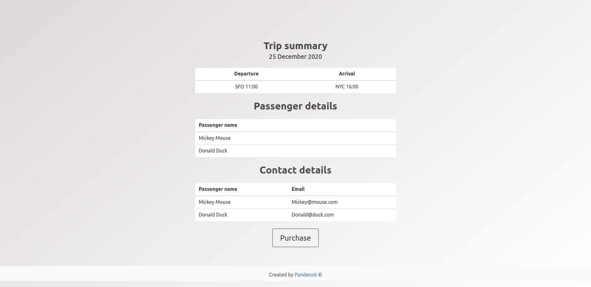

# Project: Flight Booker

### What's this

A project completed as part of [The Odin Ruby on Rails Learning Track](https://www.theodinproject.com/courses/ruby-on-rails/lessons/building-advanced-forms) to tackle some advanced forms. The project involves building of a typical checkout process for booking a one-way flight.

### Functionality

A toy app designed to help the users find and book one-way flights on a specific date for up to four passengers. For the purposes of this project, it is not necessary signing up or logging in to use the app. This project is meant to solidify concepts in data associations (see Data Models block) and more 'advanced' form techniques, such as pre-populating data from multiple models through select helpers and usage of nested attributes. Nevertheless, the styling was not requested, I built a minimalistic design using `bulma` gem, a CSS framework based on Flexbox.

### Live Demo

You can try it out [here](https://pacific-spire-08808.herokuapp.com/)  
**HEADS UP**: Heroku server may need up to 30 sec to fire up a dyno. Be patient! :)

### Screenshots

<p float = 'left'>
    <figure>
    <figcaption>Landing page aka #index</figcaption>
    
    </figure>
    <figure>
    <figcaption>Search results</figcaption>
    
    </figure>
    <figure>
    <figcaption>Passenger details</figcaption>
    
    </figure>
    <figure>
    <figcaption>Booking Form</figcaption>
    
    </figure>
</p>

### Getting started

To get started with the app, make sure you have Rails and Git installed on your machine  
Clone the repo to your local machine: 
```ruby
$ git clone https://github.com/Pandenok/flight-booker
```
Then, install the needed gems:
```ruby
$ bundle install
```
Next, migrate the database:
```ruby
$ rails db:migrate
```
Load sample airports and flights:
```ruby
$ rails db:seed
```
Finally, on root path run a local server:
```ruby
$ rails server
```
Open browser to view application:
```ruby
localhost:3000
```

### Built With

- Ruby on Rails - Web framework
- Bulma - CSS framework
- Heroku - Cloud platform/server

### Data Models
```ruby
class Airport < ApplicationRecord
  has_many :departing_flights, class_name: "Flight", foreign_key: "from_airport_id" 
  has_many :arriving_flights,  class_name: "Flight", foreign_key: "to_airport_id"
end
class Flight < ApplicationRecord
  belongs_to :from_airport, class_name: "Airport", foreign_key: "from_airport_id"
  belongs_to :to_airport, class_name: "Airport", foreign_key: "to_airport_id"
  has_many :bookings
  has_many :passengers, through: :bookings
end
class Booking < ApplicationRecord
  belongs_to :flight
  has_many :passengers
  accepts_nested_attributes_for :passengers
end
class Passenger < ApplicationRecord
  belongs_to :booking
end
```

### Reflection

1. In the assignment it's suggested to 
> make your seeds file `::delete_all` items from each table in your database and then completely repopulate them. That way, when you create a new model or change how you want your sample data set up, you can just update the `seeds.rb` file and rerun `$ rake db:seed`.

This trick does delete the entries from the tables, but it doesn't reset the counts for new `id`s. After doing some more research on this topic, I found some snippets [here](https://stackoverflow.com/questions/24845316/best-way-for-a-rails-db-seed-file-to-delete-existing-data-in-certain-table-befor), [here](https://stackoverflow.com/questions/39645008/how-to-clear-database-before-seeding-in-rails) and [here](https://stackoverflow.com/questions/31186841/delete-all-records-from-all-tables-in-database-using-seeds-rb/31186879) and I combined them into the following:
```ruby
tables = ActiveRecord::Base.connection.tables - ['schema_migrations']

# In PostgreSQL, it does not do this automatically. You can use TRUNCATE TABLE table RESTART IDENTITY;
# To automatically truncate all tables that have foreign-key references to any of the named tables use CASCADE.
# tables.each do |table|
#   ActiveRecord::Base.connection.execute("TRUNCATE #{table} RESTART IDENTITY CASCADE")
# end

# In SQLite, there is no TRUNCATE statement, instead, it's
tables.each do |table|
  ActiveRecord::Base.connection.execute "DELETE FROM `#{table}`"
  ActiveRecord::Base.connection.execute "DELETE FROM sqlite_sequence WHERE name='#{table}'"
end
```

2. I haven't found how to hide a prompt message from dropdown list. There is a similar [question](https://stackoverflow.com/questions/30694318/is-it-possible-to-disable-prompt-for-collection-select) on SO, but no solution was provided. Here is a handy [fiddle](http://jsfiddle.net/gleezer/pm7cefvg/1/) to visualize the wanted result.
3. While fixing the bug on invalid date in params I found this [answer](https://stackoverflow.com/questions/5629402/how-to-test-if-parameters-exist-in-rails), which helped me understand the difference between `has_key?`, `key?`, `blank?`, `nil?`, `present?`
4. I don't know how to disable the submit button on search_results_form if there is no value selected or how to throw an error, so I've just set a parameter of radio button to `{ checked: true }`. All the suggestions I found were involving JavaScript. I may come back to that one day and fix it.
5. I feel rather confident with `bulma`, maybe it's time to try some new front-end frameworks, like `materialize` or `bootstrap`. 
6. I definitely need to learn `simple form` gem as well.